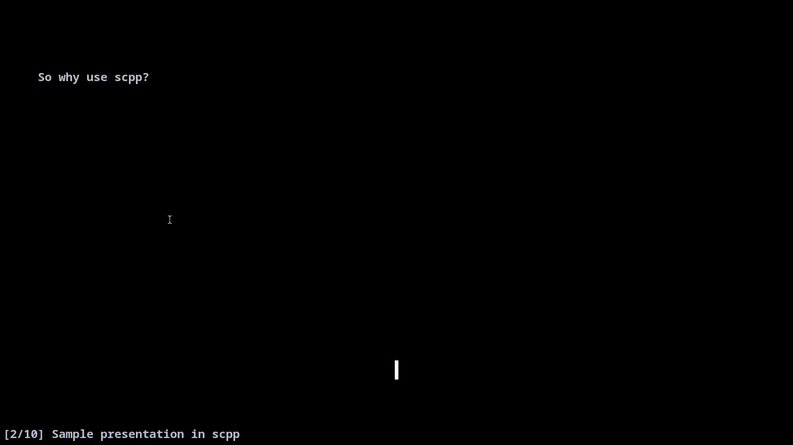

# scpp
Simple C Powerpoint.

This repo was inspired by [tpp](https://github.com/cbbrowne/tpp) and written in C with ncurses, so it is very likely you can compile it right away.
The program is very minimal (~350 SLOC) and is still on very early development.

## Installation
Just write on your terminal

	$ git clone https://github.com/JoseCuevasBtos/scpp.git
	$ cd scpp
	$ sudo make install

and *voila*! To uninstall do

	$ sudo make uninstall

## Usage
Just type

	$ scpp filename

You can also use the options `-s 3` to open at the third slide, `-s -2` to open at the second last slide and `-f` to open at the final slide.

The keys are also quite simple

	l, space, enter ....... go next slide
	h, backspace .......... go previous slide
	g ..................... go first slide
	G ..................... go last slide
	q ..................... quit

## Writing a presentation
The title uses

	--title: Titlename
	--subtitle: An interesting subtitle
	--author: Me
	--date: Today

To make a new slide do `--newpage`, the normal slides use markdown and other options:

	# Slide title
	## Slide subtitle

	--bcenter: Centered bold text
	This is normal text, while *this is on italics*, and **this is on boldface**.
	--icenter: Centered italics
	--center: Centered text

You can break one slide into multiple parts by using

	# Slide title
	Hey
	--
	this is on multiple slides
	--
	try it!

## Todo

- [ ] Add utf8 support.
